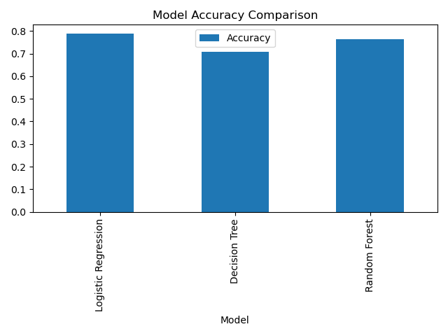

<h1 style="color: #1e90ff; font-size: 2.8em; text-shadow: 2px 2px 4px rgba(0,0,0,0.2);"> Loan Approval Prediction Model</h1>
  
A Machine Learning project to predict loan application approvals based on applicant details.
   

    
    
    
    
    
    
    
  

<h2 style="color: #ffffff; margin-top: 0;"> Project Overview</h2>
  

    This project leverages <strong>Machine Learning</strong> to predict whether a loan application will be <strong>approved</strong> or <strong>rejected</strong> based on various applicant details. The comprehensive dataset includes crucial features such as <strong>applicant income</strong>, <strong>loan amount</strong>, <strong>credit history</strong>, <strong>education level</strong>, and <strong>property area</strong>, enabling a sophisticated prediction model.
  

<h2 style="color: #1e90ff;">Technologies & Libraries</h2>
  <table style="width: 100%; border-collapse: collapse; margin-top: 15px;">
    <thead>
      <tr style="background-color: #1e90ff; color: white;">
        <th style="padding: 12px; text-align: left; border: 1px solid #ddd;">Technology</th>
        <th style="padding: 12px; text-align: left; border: 1px solid #ddd;">Purpose</th>
      </tr>
    </thead>
    <tbody>
      <tr style="background-color: #ffffff;">
        <td style="padding: 12px; border: 1px solid #ddd;"><strong>Python</strong></td>
        <td style="padding: 12px; border: 1px solid #ddd;">Primary programming language for development</td>
      </tr>
      <tr style="background-color: #f0f4ff;">
        <td style="padding: 12px; border: 1px solid #ddd;"><strong>Pandas</strong></td>
        <td style="padding: 12px; border: 1px solid #ddd;">Data manipulation, cleaning, and analysis</td>
      </tr>
      <tr style="background-color: #ffffff;">
        <td style="padding: 12px; border: 1px solid #ddd;"><strong>NumPy</strong></td>
        <td style="padding: 12px; border: 1px solid #ddd;">Numerical operations and array handling</td>
      </tr>
      <tr style="background-color: #f0f4ff;">
        <td style="padding: 12px; border: 1px solid #ddd;"><strong>Matplotlib & Seaborn</strong></td>
        <td style="padding: 12px; border: 1px solid #ddd;">Data visualization and statistical plots</td>
      </tr>
      <tr style="background-color: #ffffff;">
        <td style="padding: 12px; border: 1px solid #ddd;"><strong>Scikit-learn</strong></td>
        <td style="padding: 12px; border: 1px solid #ddd;">Machine learning models and evaluation metrics</td>
      </tr>
      <tr style="background-color: #f0f4ff;">
        <td style="padding: 12px; border: 1px solid #ddd;"><strong>Jupyter Notebook</strong></td>
        <td style="padding: 12px; border: 1px solid #ddd;">Interactive development and documentation</td>
      </tr>
    </tbody>
  </table>

<h2 style="color: #ff9800;"> Machine Learning Models</h2>
  

    

      <h3 style="color: #ff9800; margin-top: 0;"> Logistic Regression</h3>
      
A fundamental classification algorithm that models the probability of binary outcomes.

    

    

      <h3 style="color: #ff9800; margin-top: 0;"> Decision Tree</h3>
      
A non-parametric method for classification with interpretable decision rules.

    

    

      <h3 style="color: #ff9800; margin-top: 0;"> Random Forest</h3>
      
An ensemble method combining multiple decision trees for robust predictions.

    

  

<h2 style="color: #2e7d32;">Project Workflow (Step-by-Step)</h2>
  <ol style="font-size: 1.05em; line-height: 2.2; color: #333;">
    <li><strong> Import Libraries</strong> - Loading essential libraries (NumPy, Pandas, Matplotlib, Seaborn, Scikit-learn)</li>
    <li><strong> Load Dataset</strong> - Reading the loan prediction dataset from CSV file</li>
    <li><strong>Data Cleaning</strong> - Removing unnecessary columns and handling missing values using mode and median</li>
    <li><strong> Label Encoding</strong> - Converting categorical features (Gender, Married, Education, etc.) to numerical format</li>
    <li><strong> Data Visualization</strong> - Creating visualizations including loan status distribution and correlation heatmap</li>
    <li><strong>Feature-Target Split</strong> - Separating features (X) and target variable (y)</li>
    <li><strong> Train-Test Split</strong> - Dividing dataset into 80% training and 20% testing data</li>
    <li><strong> Feature Scaling</strong> - Normalizing numerical features using StandardScaler</li>
    <li><strong> Model Training</strong> - Training three different ML models on the training data</li>
    <li><strong>Model Evaluation</strong> - Assessing performance using Precision, Recall, F1 Score, and Accuracy</li>
    <li><strong> Results Comparison</strong> - Creating accuracy comparison visualization</li>
  </ol>

<h2 style="color: #6a1b9a;"> Dataset Information</h2>
  

    The dataset used in this project is stored in the <code style="background-color: #f0f0f0; padding: 2px 6px; border-radius: 3px;">data</code> folder within the repository. It contains comprehensive information for training and evaluating the loan approval prediction models.
  

  

    
<strong>File:</strong> <code>loan-prediction-dataset.csv</code>

    
<strong>Format:</strong> CSV (Comma-Separated Values)

    
<strong>Purpose:</strong> Training and testing machine learning models

    
<strong> Key Features:</strong> Gender, Married, Dependents, Education, Self_Employed, ApplicantIncome, CoapplicantIncome, LoanAmount, Loan_Amount_Term, Credit_History, Property_Area, Loan_Status

  

<h2 style="color: #00695c;">Project Structure</h2>
  <pre style="background-color: #263238; color: #aed581; padding: 15px; border-radius: 8px; font-family: 'Courier New', Courier, monospace; overflow-x: auto;">
loan-approval-prediction/
├──  data/
│   └──  loan-prediction-dataset.csv
├──  loan_model.ipynb
├──  Correlation Heatmap.png
├── accuracy_comparison.png
└── README.md
  </pre>

<h2 style="color: #c2185b;"> Model Evaluation Metrics</h2>
  

    The performance of the trained models was rigorously evaluated using the following comprehensive metrics:
  

  

    

      <h4 style="color: #c2185b; margin-top: 0;">Accuracy</h4>
      
Overall correctness of the model predictions

    

    

      <h4 style="color: #c2185b; margin-top: 0;"> Precision</h4>
      
Accuracy of positive predictions (approved loans)

    

    

      <h4 style="color: #c2185b; margin-top: 0;"> Recall</h4>
      
Coverage of actual positive cases in the dataset

    

    

      <h4 style="color: #c2185b; margin-top: 0;"> F1 Score</h4>
      
Harmonic mean of precision and recall

    

    

      <h4 style="color: #c2185b; margin-top: 0;"> Confusion Matrix</h4>
      
Detailed breakdown of true positives, false positives, true negatives, and false negatives

    

  

<h2 style="color: #e65100;"> Project Output & Visualizations</h2>   <h3 style="color: #ff6f00; margin-top: 0;"> Accuracy Comparison</h3>
  

    

      <em>Visual comparison of model accuracies across Logistic Regression, Decision Tree, and Random Forest</em>
    

    
  
   <h3 style="color: #ff6f00;"> Correlation Heatmap</h3>
  

    

      <em>Visual representation of feature correlations in the dataset</em>
    

    
  
   <h3 style="color: #ff6f00;"> Loan Status Distribution</h3>
  

    

      <em>Distribution of approved and rejected loan applications in the dataset</em>
    

    

      <strong>Placeholder:</strong> Replace with your actual loan status distribution chart
    

  

<h2 style="color: #1b5e20;"> Key Features</h2>
  <ul style="font-size: 1.05em; line-height: 2; color: #333;">
    <li><strong>Comprehensive Data Preprocessing</strong> - Handles missing values using mode and median imputation</li>
    <li> <strong>Label Encoding</strong> - Converts categorical features to numerical format for model training</li>
    <li> <strong>Feature Scaling</strong> - Normalizes features using StandardScaler for optimal model performance</li>
    <li> <strong>Multiple ML Models</strong> - Implements three different classification algorithms</li>
    <li><strong>Detailed Evaluation</strong> - Uses multiple metrics (Precision, Recall, F1 Score, Accuracy)</li>
    <li><strong>Data Visualization</strong> - Includes correlation analysis and performance comparisons</li>
    <li><strong>Jupyter Notebook</strong> - Interactive and well-documented code with clear comments</li>
  </ul>

<h2 style="color: #0d47a1;">How to Use</h2>
  <ol style="font-size: 1.05em; line-height: 2.2; color: #333;">
    <li><strong>Clone the Repository</strong>
      <pre style="background-color: #263238; color: #aed581; padding: 10px; border-radius: 5px; font-family: 'Courier New', Courier, monospace; overflow-x: auto;">git clone https://github.com/yourusername/loan-approval-prediction.git
cd loan-approval-prediction</pre>
    </li>
    <li><strong>Install Dependencies</strong>
      <pre style="background-color: #263238; color: #aed581; padding: 10px; border-radius: 5px; font-family: 'Courier New', Courier, monospace; overflow-x: auto;">pip install pandas numpy matplotlib seaborn scikit-learn jupyter</pre>
    </li>
    <li><strong>Place Dataset</strong> - Ensure <code>loan-prediction-dataset.csv</code> is in the <code>data</code> folder</li>
    <li><strong>Open the Jupyter Notebook</strong>
      <pre style="background-color: #263238; color: #aed581; padding: 10px; border-radius: 5px; font-family: 'Courier New', Courier, monospace; overflow-x: auto;">jupyter notebook loan_model.ipynb</pre>
    </li>
    <li><strong>Run the Cells</strong> - Execute cells sequentially to load data, train models, and evaluate performance</li>
  </ol>

<h2 style="color: #33691e;"> Learning Outcomes</h2>
  

    Through this project, you will gain proficiency in:
  

  <ul style="font-size: 1.05em; line-height: 2; color: #333;">
    <li> <strong>Data Preprocessing Techniques</strong> - Cleaning, handling missing values, and preparing data for ML</li>
    <li> <strong>Feature Engineering</strong> - Label encoding and feature scaling for improved model performance</li>
    <li> <strong>Machine Learning Classification</strong> - Building and training multiple classification models</li>
    <li> <strong>Model Evaluation</strong> - Assessing model performance with various metrics and confusion matrices</li>
    <li> <strong>Data Visualization</strong> - Creating insightful plots, heatmaps, and comparison charts</li>
    <li> <strong>Ensemble Methods</strong> - Understanding how Random Forest combines multiple models</li>
  </ul>

<h2 style="color: #1565c0;"> Model Performance Summary</h2>
  

    The three models are evaluated on the test dataset with the following metrics:
  

  <table style="width: 100%; border-collapse: collapse;">
    <thead>
      <tr style="background-color: #2196f3; color: white;">
        <th style="padding: 12px; text-align: left; border: 1px solid #ddd;">Model</th>
        <th style="padding: 12px; text-align: center; border: 1px solid #ddd;">Precision</th>
        <th style="padding: 12px; text-align: center; border: 1px solid #ddd;">Recall</th>
        <th style="padding: 12px; text-align: center; border: 1px solid #ddd;">F1 Score</th>
        <th style="padding: 12px; text-align: center; border: 1px solid #ddd;">Accuracy</th>
      </tr>
    </thead>
    <tbody>
      <tr style="background-color: #ffffff;">
        <td style="padding: 12px; border: 1px solid #ddd;"><strong>Logistic Regression</strong></td>
        <td style="padding: 12px; text-align: center; border: 1px solid #ddd;">0.7596153846153846</td>
        <td style="padding: 12px; text-align: center; border: 1px solid #ddd;">0.9875</td>
        <td style="padding: 12px; text-align: center; border: 1px solid #ddd;">0.8586956521739131</td>
        <td style="padding: 12px; text-align: center; border: 1px solid #ddd;">0.7886178861788617</td>
      </tr>
      <tr style="background-color: #e3f2fd;">
        <td style="padding: 12px; border: 1px solid #ddd;"><strong>Decision Tree</strong></td>
        <td style="padding: 12px; text-align: center; border: 1px solid #ddd;">0.7682926829268293</td>
        <td style="padding: 12px; text-align: center; border: 1px solid #ddd;">0.7875</td>
        <td style="padding: 12px; text-align: center; border: 1px solid #ddd;">0.7777777777777778</td>
        <td style="padding: 12px; text-align: center; border: 1px solid #ddd;">0.7073170731707317</td>
      </tr>
      <tr style="background-color: #ffffff;">
        <td style="padding: 12px; border: 1px solid #ddd;"><strong>Random Forest</strong></td>
        <td style="padding: 12px; text-align: center; border: 1px solid #ddd;">0.7524752475247525</td>
        <td style="padding: 12px; text-align: center; border: 1px solid #ddd;">0.95</td>
        <td style="padding: 12px; text-align: center; border: 1px solid #ddd;">0.8397790055248618</td>
        <td style="padding: 12px; text-align: center; border: 1px solid #ddd;">0.7642276422764228</td>
      </tr>
    </tbody>
  </table>
  

<h2 style="color: #ffffff; margin-top: 0;"> Author</h2>
  
Sonia Thakur

    ⭐ If you found this project helpful, please consider giving it a star on GitHub!
  

